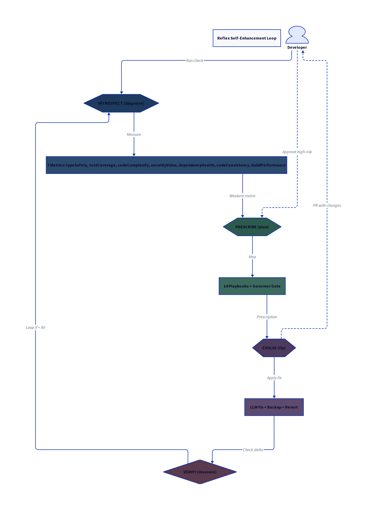

# Reflex

**Your code's reflex. Quality on automatic.**

Reflex is a self-enhancing code quality system. It measures 10 code health metrics, identifies the weakest area, generates a remediation plan from 17 playbooks, executes fixes autonomously, and verifies the results.

Your code fixes itself on reflex.




---

## The Problem

Technical debt compounds silently. Every sprint, code quality degrades — type coverage slips, tests go unwritten, complexity grows, dependencies rot. By the time you notice, it's a two-week refactor nobody has time for.

Code reviews catch symptoms, not root causes. Linters flag violations but can't explain *why*. CI fails but doesn't suggest fixes.

**Reflex closes the loop.** It diagnoses, prescribes, and treats — automatically.

---

## For Beginners — No Commands Needed


### Security Scanner

Detects vulnerabilities before they reach production:

```bash
reflex security --project ./my-app
```

**Detects:**
| Type | CVSS | Examples |
|------|------|----------|
| SQL Injection | 9.8 | Unparameterized queries |
| XSS | 6.1 | innerHTML with user input |
| RCE | 10.0 | eval(), exec() with user input |
| Secrets | 9.1 | Hardcoded API keys, passwords |
| SSRF | 7.5 | Fetch with user-provided URLs |
| Path Traversal | 7.5 | readFile with user input |
| XXE | 9.8 | Unconfigured XML parsers |

**Output:**
```
═ REFLEX SECURITY SCAN REPORT ═
Project: ./my-app
Total Findings: 3

🔴 CRITICAL (1)
  [SQLI] src/db/queries.ts:42
  CVSS: 9.8 | SQL Injection detected
  Fix: Use parameterized queries

🟠 HIGH (2)
  [SECRETS] src/config.ts:15
  CVSS: 9.1 | Hardcoded API key
  Fix: Use environment variables

Security Score: 94/100
```

---

## Dev Tools (from CodeRabbit & Others)

### Plan Generator

Turn vague ideas into clear phased plans:

```bash
reflex plan "add user authentication"
```

**Output:**
```
═ DEVELOPMENT PLAN: USER AUTHENTICATION ═

┌─ PHASE 1: Research & Design ─────────────
│  Tasks:
│  □ Analyze requirements
│  □ Design auth flow
│  □ Choose auth provider
│  Risks:
│  ⚠ Unclear OAuth scope requirements
└──────────────────────────────────────────────

┌─ PHASE 2: Implementation ───────────────────
│  Tasks:
│  □ Set up auth middleware
│  □ Implement login/register endpoints
│  □ Add session management
│  Dependencies:
│  → Design approved
└──────────────────────────────────────────────
```

### Pre-commit Hook

Quality gate before every commit:

```bash
reflex pre-commit --install   # Install git hook
reflex pre-commit --fix       # Auto-fix issues
```

### Analytics Tracking

Track quality over time:

```bash
reflex analytics --record     # Save current score
reflex analytics --weekly     # Weekly trends
```

### Risk Scoring

Calculate PR risk level:

```bash
reflex risk --files 15 --lines 300 --database
```

### Knowledge Graph

Ask questions about your codebase:

```bash
reflex graph --question "how does auth work?"
reflex graph --format mermaid > graph.md
```

---

## Ways to Import Your Code

### 1. CLI — Local Project or GitHub URL (All Users)
```bash
# Local project
reflex introspect --project ./my-app
reflex check ./my-app

# GitHub repository (public or private)
reflex introspect --project https://github.com/username/my-app
reflex check https://github.com/username/repo

# GitHub shorthand
reflex introspect --project username/repo
```
Best for: Private repos, local development, CI/CD, remote analysis.

### 2. CLI — Natural Language (Beginners)
```bash
reflex ask "check my code in this folder"
reflex ask "fix the problems"
```
Just describe what you want. No flags, no commands to memorize.

### 3. GitHub Webhook (Teams)
Connect your repo → Automatic PR analysis.
See: [GitHub App Setup](#github-app--pr-quality-checks)


## CLI Reference

The CLI is fully available. Use it for:

- Local development
- CI/CD pipelines
- Private repositories
- Batch analysis
- Custom configurations

### Quick Commands

```bash
reflex check [path]              # Quick health check
reflex fix [path]                # Safe auto-fix
reflex ask "your question"       # Natural language Q&A
```

### Options

```bash
--project <path>     # Project directory (default: current)
--json               # JSON output for scripts
--verbose            # Detailed breakdown
--dry-run            # Preview fixes without applying
--max <n>            # Max cycles (for full-cycle)
```

---

## Quick Start

### Install

```bash
# Clone
git clone https://github.com/larsontrey720/reflex.git
cd reflex

# Install dependencies
bun install

# Link globally (enables `reflex` command everywhere)
bun link
```

Now you can run:

```bash
reflex --help
reflex check https://github.com/owner/repo
reflex introspect --project ./my-app
```

### Run

```bash
# Diagnose your codebase (local)
reflex check ./my-app

# Diagnose a GitHub repo
reflex check https://github.com/username/repo

# Full self-enhancement cycle
reflex full-cycle --project ./my-app
```

---

## How It Works

### The Reflex Loop

```
INTROSPECT → PRESCRIBE → EVOLVE → VERIFY → (repeat)
```

1. **Introspect** — Measures 10 health metrics, outputs composite score (0-100)
2. **Prescribe** — Maps weakest metric to a playbook from 17 options, generates fix specification
3. **Evolve** — Executes fixes via LLM, captures before/after scores
4. **Verify** — Reverts regressions, logs improvements, loops

### 10 Health Metrics

| Metric | What It Measures | Target |
|--------|------------------|--------|
| Type Integrity | TypeScript strictness, `any` elimination | ≥ 95% |
| Test Breadth | Line/branch coverage | ≥ 85% |
| Test Depth | Edge cases, error paths, integration | ≥ 75% |
| Cyclomatic Load | Complexity per function | ≤ 12 |
| Coupling Factor | Dependencies between modules | ≤ 40% cross-module |
| Vulnerability Score | Known CVEs in dependencies | 0 critical/high |
| Dependency Freshness | Outdated packages | ≥ 90% current |
| Lint Hygiene | Violations, formatting | ≥ 98% clean |
| Documentation Ratio | Commented public APIs | ≥ 80% |
| Build Efficiency | Build time, bundle size | Stable or improving |

### 17 Playbooks

When a metric is weak, Reflex selects from 17 remediation playbooks:

#### Type Integrity (3)
| ID | Playbook | Auto-Approve |
|----|----------|--------------|
| A | Strict Mode Enablement | Yes |
| B | Any Type Elimination | No |
| C | Generic Constraint Addition | Yes |

#### Test Breadth (3)
| ID | Playbook | Auto-Approve |
|----|----------|--------------|
| D | Coverage Gap Filling | Yes |
| E | Missing Branch Tests | Yes |
| F | Critical Path Coverage | No |

#### Test Depth (2)
| ID | Playbook | Auto-Approve |
|----|----------|--------------|
| G | Edge Case Injection | Yes |
| H | Error Path Verification | No |

#### Cyclomatic Load (2)
| ID | Playbook | Auto-Approve |
|----|----------|--------------|
| I | Function Decomposition | Yes |
| J | Guard Clause Extraction | Yes |

#### Coupling Factor (2)
| ID | Playbook | Auto-Approve |
|----|----------|--------------|
| K | Interface Extraction | No |
| L | Module Boundary Enforcement | No |

#### Vulnerability Score (2)
| ID | Playbook | Auto-Approve |
|----|----------|--------------|
| M | CVE Patch Application | Yes |
| N | Vulnerable Dependency Swap | No |

#### Dependency Freshness (1)
| ID | Playbook | Auto-Approve |
|----|----------|--------------|
| O | Batch Update Execution | Yes |

#### Lint Hygiene (1)
| ID | Playbook | Auto-Approve |
|----|----------|--------------|
| P | Auto-Fix Application | Yes |

#### Documentation Ratio (1)
| ID | Playbook | Auto-Approve |
|----|----------|--------------|
| Q | API Doc Generation | Yes |

**No = Requires human approval (governor blocks autonomous execution)**

### Governor Safety Rules

Reflex won't destroy your codebase:

1. **Approval gate** — Critical playbooks require human approval
2. **Blast radius limit** — Max 5 files modified per cycle
3. **Regression detection** — Any metric dropping >2% triggers automatic revert
4. **Git backup** — Pre-execution snapshot, easy rollback
5. **Audit trail** — Every cycle logged with full metadata

---

## LLM Integration

Reflex supports multiple LLM backends:

### Zo Computer (Native)

When running inside Zo Computer, Reflex auto-detects your model:

```bash
# Zero configuration needed
reflex introspect --project ./my-app
```

### BYO-Model

Configure your own LLM:

```bash
# OpenAI
export REFLEX_LLM_PROVIDER=openai
export REFLEX_LLM_API_KEY=sk-xxx
export REFLEX_LLM_MODEL=gpt-5.4

# Anthropic
export REFLEX_LLM_PROVIDER=anthropic
export REFLEX_LLM_API_KEY=sk-ant-xxx
export REFLEX_LLM_MODEL=claude-opus-4-6

# Ollama (local)
export REFLEX_LLM_PROVIDER=ollama
export REFLEX_LLM_MODEL=qwen3.5:27b

# Custom endpoint
export REFLEX_LLM_PROVIDER=custom
export REFLEX_LLM_ENDPOINT=https://my-api.com/v1
export REFLEX_LLM_API_KEY=xxx
```

---

## Commands

```bash
# === SETUP ===
reflex setup                      # Interactive setup wizard
reflex llm --config               # Show LLM configuration
reflex llm --test                 # Test LLM connection

# === ANALYSIS ===
reflex check [path]               # Quick health check
reflex introspect [options]       # Detailed analysis
reflex security [options]         # Vulnerability scan
reflex risk --pr 42               # Calculate PR risk

# === FIXES ===
reflex fix [path]                 # Safe auto-fix
reflex prescribe [options]        # Generate fix plan
reflex evolve [options]           # Execute fixes
reflex full-cycle [options]       # Complete self-healing loop

# === PLANNING ===
reflex plan "your idea"           # Generate development plan
reflex interview                  # Socratic requirements gathering
reflex graph --question "..."     # Ask about codebase

# === HELP ===
reflex unstuck --problem "..."    # Debug help with personas
reflex ask "your question"        # Natural language Q&A
reflex explain <metric>           # Plain English docs

# === DEV TOOLS ===
reflex eval --artifact <path> --seed <file>   # Three-stage verification
reflex pre-commit --install       # Install git hook
reflex pre-commit --fix           # Auto-fix on commit
reflex analytics --record         # Track quality over time
```

### Common Options

```bash
--project <path>     # Project directory (default: current)
--json               # JSON output for scripts
--verbose            # Detailed breakdown
--dry-run            # Preview fixes without applying
--max <n>            # Max cycles (for full-cycle)
--scorecard <file>   # Input scorecard (for prescribe)
--prescription <file> # Input prescription (for evolve)
```

### Examples

```bash
# Analyze a GitHub repo
reflex check https://github.com/owner/repo

# Analyze local project
reflex introspect --project ./my-app

# JSON output for CI/CD
reflex introspect --project . --json > scorecard.json

# Full autonomous healing
reflex full-cycle --project ./my-app --max 3

# Security scan
reflex security --project ./my-app --json

# Get unstuck on a bug
reflex unstuck --problem "I keep hitting null pointer exceptions"

# Ask about your code
reflex ask "Why is my build slow?"
```

---

## Deployment

### Docker

```bash
docker build -t reflex .
docker run -v /path/to/project:/project reflex introspect --project /project
```

### Docker Compose

```yaml
# docker-compose.yml included
docker-compose up  # Runs weekly scheduled introspection
```

### GitHub Actions

```yaml
# .github/workflows/reflex.yml included
# Runs every Monday at 6am UTC
# Opens an issue with scorecard and recommendations
```

### Bun CLI

```bash
bun link  # Install globally
reflex introspect --project ./my-app
```

---

## Skill Reference

Reflex is built as modular Zo Skills:

| Skill | Purpose |
|-------|---------|
| `reflex-introspect` | Diagnostic scorecard |
| `reflex-prescribe` | Prescription engine |
| `reflex-evolve` | Evolution executor |
| `reflex-loop` | Single-metric optimization |
| `reflex-interview` | Socratic requirements |
| `reflex-eval` | Three-stage verification |
| `reflex-unstuck` | 9 debug personas |

Each skill can be used independently:

```bash
bun skills/reflex-introspect/scripts/introspect.ts --project ./app
bun skills/reflex-unstuck/scripts/unstuck.ts --problem "async race condition"
```

---

## Unstuck Personas (9 Total)

When you're stuck on a problem, Reflex has 9 lateral-thinking personas:

| Persona | When to Use |
|---------|-------------|
| **Debugger** | Errors, exceptions, crashes |
| **Investigator** | Unexpected behavior, confusion |
| **Pruner** | Overwhelming complexity |
| **Structurer** | Coupling, fragility |
| **Polisher** | Code quality, technical debt |
| **Challenger** | Questioning the approach |
| **Prototyper** | Analysis paralysis, design decisions |
| **Automator** | Repetitive work, toil |
| **Shipper** | Perfectionism, release blocking |

```bash
reflex unstuck --problem "I keep hitting null pointer exceptions"
# → Auto-selects Debugger persona

reflex unstuck --persona structurer
# → Get Structurer's perspective
```

---

## Example Output

```
$ reflex introspect --project ./my-app

Analyzing project: /home/user/my-app

==========================================================
  REFLEX INTROSPECTION SCORECARD
==========================================================
  [OK]   Type Integrity       96% → score: 100%
  [WARN] Test Breadth         52% → score: 61%
  [WARN] Test Depth           38% → score: 51%
  [OK]   Cyclomatic Load       6 → score: 100%
  [OK]   Coupling Factor      28% → score: 100%
  [OK]   Vulnerability Score   0 → score: 100%
  [OK]   Dependency Freshness 94% → score: 100%
  [OK]   Lint Hygiene         99% → score: 100%
  [WARN] Documentation Ratio  62% → score: 78%
  [OK]   Build Efficiency     1.8s → score: 100%
----------------------------------------------------------
  COMPOSITE HEALTH: 89/100
  WEAKEST: Test Depth (needs attention)
==========================================================

Recommendation: Run 'reflex prescribe' to generate improvement plan
```

---

## Architecture

```
┌─────────────────────────────────────────────────────────────┐
│                      DEVELOPER                               │
│   • Approves critical playbooks                             │
│   • Receives scorecard reports                              │
│   • Can override governor                                   │
└────────────────────────────┬────────────────────────────────┘
                             │
         ┌───────────────────┼───────────────────┐
         ▼                   ▼                   ▼
  ┌─────────────┐     ┌─────────────┐     ┌─────────────┐
  │ INTROSPECT  │────▶│  PRESCRIBE  │────▶│   EVOLVE    │
  │ (diagnose)  │     │   (plan)    │     │  (execute)  │
  │             │     │             │     │             │
  │ 10 metrics  │     │ 17 playbooks│     │ LLM fixes   │
  │ Score 0-100 │     │ Governor    │     │ Pre/post    │
  └─────────────┘     └─────────────┘     └─────────────┘
         │                   │                   │
         └───────────────────┼───────────────────┘
                             ▼
                      ┌─────────────┐
                      │   VERIFY    │
                      │  (revert    │
                      │   on fail)  │
                      └─────────────┘
```

---

## Requirements

- **Bun** v1.0+ (runtime)
- **TypeScript** (for type analysis)
- **Git** (for snapshots/rollback)
- **LLM API** (OpenAI, Anthropic, Ollama, or Zo native)

---

## Credits

Built for [Zo Computer](https://zocomputer.com).

---

## License

MIT

---

## GitHub App — PR Quality Checks

Reflex automatically analyzes your pull requests and posts quality scorecards as PR comments. No CLI needed — just connect your repo.

### Quick Setup (Public Instance)

Use the hosted Reflex instance on any public or private repo:

**Step 1: Create a GitHub Personal Access Token**

1. Go to https://github.com/settings/personal-access-tokens/new
2. Configure:
   - **Name**: `Reflex Bot`
   - **Expiration**: 90 days (or custom)
   - **Repository access**: 
     - Option A: "Only select repositories" → pick your repos
     - Option B: "All repositories" (if you want it everywhere)
   - **Permissions**:
     - `Contents`: Read
     - `Pull requests`: Read and Write
     - `Metadata`: Read
3. Click "Generate token"
4. Copy the token (you won't see it again)

**Step 2: Add Webhook to Your Repo**

1. Go to your repository → Settings → Webhooks → Add webhook
2. Configure:
   - **Payload URL**: `https://georgeo.zo.space/api/reflex-webhook`
   - **Content type**: `application/json`
   - **Secret**: `reflex-public-2026` (or generate your own)
   - **Which events**: Select "Let me select individual events" → check only "Pull requests"
   - **Active**: Yes
3. Click "Add webhook"

**Step 3: Set Your Token (If Using Custom Secret)**

If you used a custom webhook secret instead of `reflex-public-2026`, email the token and secret to set up access:
- **Email**: georgeo@zo.computer
- **Subject**: Reflex Bot Access Request
- **Body**: Your PAT token and webhook secret

**Step 4: Test It**

1. Open a pull request in your repo
2. Wait ~10 seconds
3. See the Reflex quality scorecard appear as a comment

---

### What You'll See

When you open or update a PR, Reflex posts a comment like this:

```markdown
## ⚡ Reflex Quality Check

**Score: 78/100** (+6 from base)

| Metric | Value | Status | Change |
|--------|-------|--------|--------|
| Type Integrity | 89% | ✓ | +3% |
| Test Breadth | 72% | ⚠ | -2% |
| Test Depth | 45% | ⚠ | +5% |
| Cyclomatic Load | 8 avg | ✓ | -1 |
| Coupling Factor | 32% | ✓ | — |
| Vulnerability Score | 0 | ✓ | — |
| Dependency Freshness | 94% | ✓ | +2% |
| Lint Hygiene | 97% | ✓ | +1% |
| Documentation Ratio | 67% | ⚠ | — |
| Build Efficiency | 1.2s | ✓ | -0.3s |

### Recommendations

1. **Test Breadth** dropped 2%. Consider adding tests for:
   - `src/utils/parser.ts` (line 42-67 uncovered)
   - `src/api/handlers.ts` (error path untested)

2. **Documentation Ratio** at 67%. Add JSDoc to:
   - `processPayment()` — public API, no docs
   - `validateInput()` — complex logic, needs explanation

---
_Analyzed by [Reflex](https://github.com/larsontrey720/reflex) • [Setup on your repo](https://github.com/larsontrey720/reflex#github-app--pr-quality-checks)_
```

---

### Configuration Options

You can customize Reflex behavior by adding a `.reflex.yml` file to your repo root:

```yaml
# .reflex.yml

# Minimum score to pass PR (blocks merge if below)
minimum_score: 70

# Metrics to include/exclude
metrics:
  include:
    - typeIntegrity
    - testBreadth
    - vulnerabilityScore
  exclude:
    - documentationRatio  # Skip docs for this project

# Auto-comment settings
comment:
  on_opened: true      # Comment on new PRs
  on_sync: true        # Comment when new commits pushed
  on_reopened: true    # Comment when PR reopened

# Fail check if score drops
fail_on_regression: true
```

---

### Self-Hosting Reflex

Want to run your own instance? Here's how:

**Option 1: Deploy to Zo Computer**

1. Fork this repo
2. Create a Zo Computer account at https://zocomputer.com
3. Create a new site from your fork
4. Add these secrets in Settings → Advanced:
   ```
   REFLEX_GITHUB_WEBHOOK_SECRET=your-secret
   REFLEX_GITHUB_APP_TOKEN=your-pat
   ```
5. Update your webhook URL to your Zo Space

**Option 2: Deploy to Your Server**

```bash
# Clone
git clone https://github.com/larsontrey720/reflex.git
cd reflex

# Install dependencies
bun install

# Set environment
export REFLEX_GITHUB_WEBHOOK_SECRET=your-secret
export REFLEX_GITHUB_APP_TOKEN=your-pat

# Run webhook server
bun serve --port 3000
```

Then point your webhook to `https://your-server.com/webhook`.

---

### Troubleshooting

**No comment appears on PR:**

1. Check webhook delivery in GitHub: Repo → Settings → Webhooks → click webhook → "Recent Deliveries"
2. Look for response code — should be 200
3. If 401/403: Token lacks permissions
4. If 500: Webhook server error — check logs

**Comment shows "Error analyzing repository":**

- Repository may be empty or have no TypeScript/JavaScript files
- Check that the repo has a `package.json` or `tsconfig.json`

**Score seems wrong:**

- Reflex analyzes TypeScript/JavaScript primarily
- For other languages, only general metrics apply (lint, dependencies)

**Want to disable for specific PRs:**

Add `[skip reflex]` or `[no reflex]` to your PR title or description.

---

### Rate Limits

The public instance has these limits:
- **Public repos**: Unlimited
- **Private repos**: 100 PRs/day per user

For higher limits, self-host your own instance.

---

### Support

- **Issues**: https://github.com/larsontrey720/reflex/issues
- **Email**: georgeo@zo.computer
- **Zo Discord**: https://discord.gg/zocomputer

---

## Notifications — Slack, Discord, Telegram

Reflex can send quality alerts to your team chat. Get notified when:
- A PR is analyzed
- Quality drops below threshold
- Autonomous fixes are applied
- Regressions are detected

### Quick Setup

Add environment variables for the platforms you want:

```bash
# Slack
export REFLEX_SLACK_WEBHOOK=https://hooks.slack.com/services/T00/B00/xxx

# Discord
export REFLEX_DISCORD_WEBHOOK=https://discord.com/api/webhooks/123/xxx

# Telegram
export REFLEX_TELEGRAM_BOT_TOKEN=123456:ABC-xxx
export REFLEX_TELEGRAM_CHAT_ID=-1001234567890

# Custom webhook
export REFLEX_CUSTOM_WEBHOOK=https://your-webhook.com/endpoint
```

Configure multiple platforms — Reflex sends to all enabled webhooks.

---

### Slack Setup

1. Go to https://api.slack.com/apps
2. Create new app → "Incoming Webhooks"
3. Activate webhooks → "Add New Webhook to Workspace"
4. Select channel → Copy webhook URL
5. Set environment variable:
   ```bash
   export REFLEX_SLACK_WEBHOOK=https://hooks.slack.com/services/T00/B00/xxx
   ```

**What you'll see:**

```
⚡ Reflex Quality Check

Score:
🟢 78/100 (+6)

Project:
myorg/my-app

Metrics:
✅ Type Integrity: 89% (+3%)
⚠️ Test Breadth: 72% (-2%)
⚠️ Test Depth: 45% (+5%)
✅ Cyclomatic Load: 8 avg (-1)
✅ Coupling Factor: 32%
✅ Vulnerability Score: 0
✅ Dependency Freshness: 94%
✅ Lint Hygiene: 97%
⚠️ Documentation Ratio: 67%
✅ Build Efficiency: 1.2s

Recommendations:
• Test Breadth dropped 2%. Add tests for src/utils/parser.ts
• Documentation Ratio at 67%. Add JSDoc to processPayment()

[View Details]

_Powered by Reflex_
```

---

### Discord Setup

1. Go to your Discord server → Channel Settings → Integrations → Webhooks
2. Click "New Webhook"
3. Name it "Reflex" (avatar auto-loaded)
4. Copy webhook URL
5. Set environment variable:
   ```bash
   export REFLEX_DISCORD_WEBHOOK=https://discord.com/api/webhooks/123/xxx
   ```

**What you'll see:**

Rich embed with:
- 🟢/🟡/🔴 color based on score
- Score with trend indicator
- Metrics in compact grid
- Recommendations section
- Clickable link to PR/cycle

---

### Telegram Setup

**Option A: Bot in Group/Channel**

1. Create bot via [@BotFather](https://t.me/BotFather) → `/newbot`
2. Copy bot token
3. Add bot to group/channel as admin
4. Get chat ID:
   - For groups: Forward a message to [@userinfobot](https://t.me/userinfobot)
   - For channels: Use `@channel_name` or numeric ID
5. Set environment variables:
   ```bash
   export REFLEX_TELEGRAM_BOT_TOKEN=123456:ABC-xxx
   export REFLEX_TELEGRAM_CHAT_ID=-1001234567890
   ```

**Option B: Personal Notifications**

1. Create bot via [@BotFather](https://t.me/BotFather)
2. Start chat with your bot
3. Get your user ID from [@userinfobot](https://t.me/userinfobot)
4. Set:
   ```bash
   export REFLEX_TELEGRAM_BOT_TOKEN=123456:ABC-xxx
   export REFLEX_TELEGRAM_CHAT_ID=123456789
   ```

**What you'll see:**

```
⚡ PR #42: Add payment processing

🟢 Score: 78/100 (📈+6)

📊 Metrics:
✅ Type Integrity: 89%
⚠️ Test Breadth: 72%
⚠️ Test Depth: 45%
✅ Cyclomatic Load: 8 avg
✅ Coupling Factor: 32%
✅ Vulnerability Score: 0
✅ Dependency Freshness: 94%
✅ Lint Hygiene: 97%
⚠️ Documentation Ratio: 67%
✅ Build Efficiency: 1.2s

📝 Recommendations:
• Test coverage dropped in src/utils/
• Add JSDoc to processPayment()

[View Details](https://github.com/...)

_Powered by [Reflex](https://github.com/larsontrey720/reflex)_
```

---

### Custom Webhooks

Send to your own endpoint:

```bash
export REFLEX_CUSTOM_WEBHOOK=https://your-server.com/webhook
```

**Payload format:**

```json
{
  "timestamp": "2026-03-24T09:30:00.000Z",
  "source": "reflex",
  "version": "1.0.0",
  "data": {
    "title": "PR #42: Add payment processing",
    "score": 78,
    "scoreChange": 6,
    "project": "myorg/my-app",
    "branch": "feature/payments",
    "pr": 42,
    "url": "https://github.com/myorg/my-app/pull/42",
    "metrics": [
      { "name": "Type Integrity", "value": "89%", "status": "ok", "change": "+3%" },
      { "name": "Test Breadth", "value": "72%", "status": "warn", "change": "-2%" }
    ],
    "recommendations": [
      "Test coverage dropped in src/utils/",
      "Add JSDoc to processPayment()"
    ]
  }
}
```

---

### Notification Events

By default, notifications fire on:
- PR opened, synced, reopened
- Full cycle completed
- Regression detected
- Autonomous fix applied

Configure in `.reflex.yml`:

```yaml
notifications:
  slack:
    events: [pr, regression, fix]  # Don't notify on cycle
    minimum_score: 70              # Only notify if below 70
  
  discord:
    events: [regression]           # Only regression alerts
  
  telegram:
    events: [pr, cycle, fix, regression]  # All events
```

---

### Rate Limits

Reflex won't spam your channels:
- Max 1 notification per PR per 5 minutes
- Max 20 notifications per hour per channel
- Duplicate events deduplicated within 10 minutes