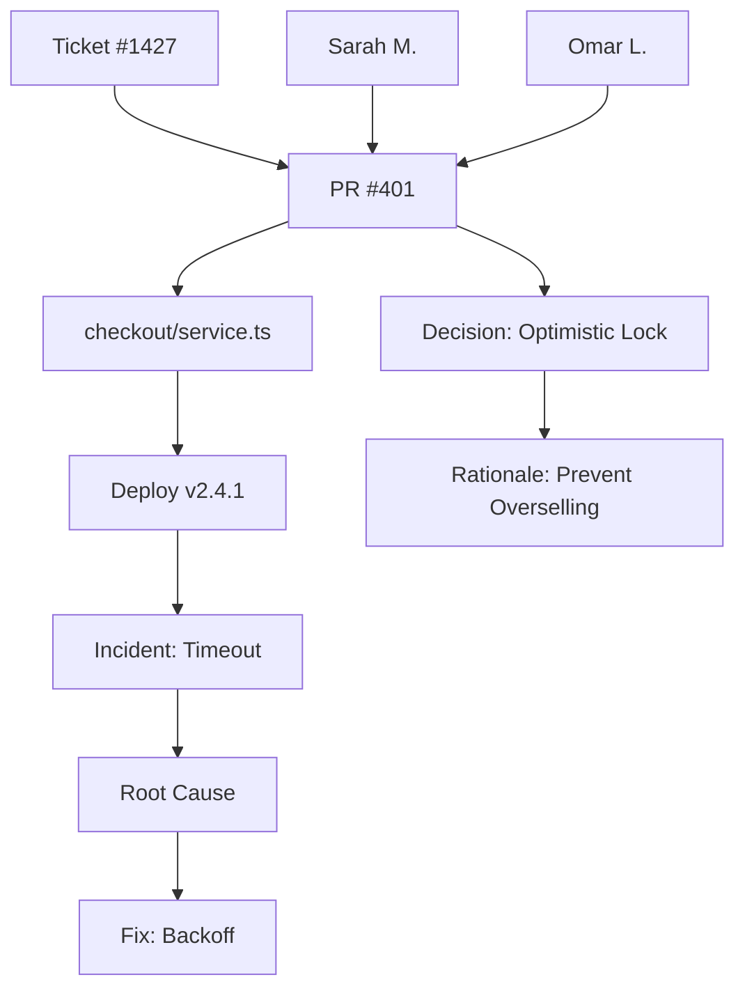

# Reflex Context

One context graph to rule them all. Connects every piece of your engineering knowledge.

## What It Does

Connects:
- **Code** — Repos, files, ownership
- **Tickets** — Jira, Zendesk, Linear
- **PRs** — Reviews, comments, decisions
- **CI/CD** — Pipelines, deploys, failures
- **Observability** — Logs, metrics, incidents
- **People** — Teams, ownership, handoffs

## Usage

```bash
# Query the context graph
reflex context "why does checkout fail?"

# Find root cause across systems
reflex context --trace "auth timeout"

# Find owner of a file/feature
reflex context --who-owns "payment-service"

# Get related context for a file
reflex context --related src/checkout/service.ts

# Export context graph as mermaid
reflex context --graph --format mermaid > context.md

# Add context manually
reflex context --add "We use OAuth2 with PKCE for SSO"
```

## Query Examples

```bash
# Natural language queries
reflex context "what broke production last week?"
reflex context "who decided to use Redis for caching?"
reflex context "what tests cover the payment flow?"

# Tracing
reflex context --trace "why did ticket-1427 escalate?"
# Output: Shows PR → code change → deploy → incident → escalation chain

# Ownership
reflex context --who-owns "billing"
# Output: Sarah M. (backend), Omar L. (QA), feature-team-alpha
```

## Output

```
═ CONTEXT GRAPH QUERY ═

Query: "why does checkout fail?"

┌─ RESULT TRACE ──────────────────────────────────────┐
│                                                       │
│  📋 Ticket #1427 (2 days ago)                        │
│     "Billing edits fail after checkout change"       │
│                                                       │
│  └── 🔀 PR #401 (3 days ago)                         │
│       "Refactor checkout flow for concurrency"       │
│       Author: @sarah-m                               │
│       Review: @omar-l approved                       │
│                                                       │
│      └── 📝 Decision (PR comment)                    │
│           "Using optimistic locking for inventory"   │
│           Rationale: "Prevents overselling"          │
│                                                       │
│         └── 🚨 Incident (Datadog)                    │
│              "Timeout spike in checkout-service"     │
│              Time: 2h after deploy                   │
│                                                       │
│            └── 🔧 Root Cause                         │
│                 "Optimistic lock retries exceed      │
│                  timeout under high load"            │
│                                                       │
│              └── ✅ Fix (committed)                   │
│                   "Increased timeout, added backoff" │
│                   Commit: a3f2c1d                    │
│                                                       │
└───────────────────────────────────────────────────────┘

RELATED CONTEXT:
  • Slack thread: #eng-ops "checkout latency concerns"
  • Doc: docs/architecture/checkout-flow.md
  • Owner: @sarah-m (checkout), @omar-l (QA)

═══════════════════════════════════════════════════════
```

## Graph Visualization

```bash
reflex context --graph --format mermaid
```



## Configuration

```yaml
# .reflex.yml
context:
  # Integrations
  integrations:
    git: true
    github: true
    jira: false  # Enable with credentials
    zendesk: false
    datadog: false
    slack: false
  
  # How much context to index
  maxDepth: 5
  
  # Cache settings
  cacheTTL: 3600  # 1 hour
```